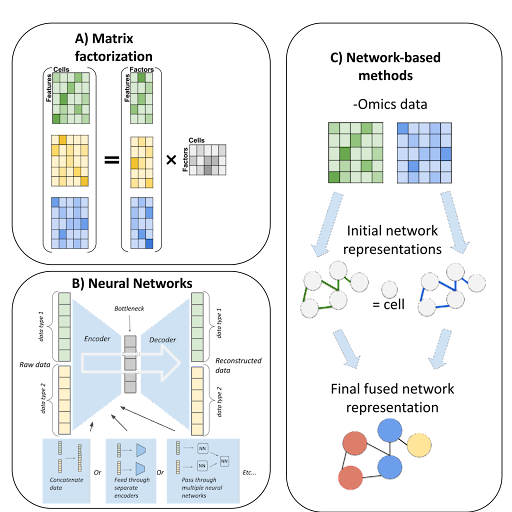

## Integration methods handling multi-omics data generated from the same single cells

The integration methods for multi-modal data assayed from the same set of single cells can be broadly categorized into at least three main types by methodology: mathematical matrix factorization methods, AI (eg. neural-network) based methods and network-based methods. The scheme of these methods is illustrated in Figure {@fig:2}. Additional less diversified approaches include a Bayesian statistical method and a metric learning method. The list of the currently implemented methods is summarized in Table @tbl:1.

{#fig:2 width="75%" height="75%"}

**Table {#tbl:1}**: Summary of the methods for integrating multi-omics data from the same cells.
| Methodology  Category | Method               | Data                                  | Algorithm                                                        | Reference |
|-----------------------|----------------------|---------------------------------------|------------------------------------------------------------------|-----------|
| Matrix Factorization  | MOFA+                | Transcriptomic, Epigenetic            | Matrix Factorization with Automatic Relevance Determination      | [@doi:10.1038/nmeth.3961]       |
|                       | scAI                 | Transcriptomic, Epigenetic            | Matrix factorization, with custom aggregation of epigenetic data | [@doi:10.3389/fgene.2017.00084]      |
| Neural Network        | totalVI              | Transcriptomic, Proteomic             | Variational autoencoder                                          | [@doi:10.1016/j.tibtech.2020.02.013]      |
|                       | scMVAE               | Transcriptomic, Epigenetic            |                                                                  | [@doi:10.1093/bib/bbaa042]      |
|                       | DCCA                 | Transcriptomic, Epigenetic            |                                                                  | [@doi:10.1093/bioinformatics/btab403]      |
|                       | LIBRA                | Transcriptomic, Proteomic, Epigenetic | Split-brain autoencoder                                          | [@doi:10.1038/s41581-021-00463-x]      |
|                       | BABEL                | Transcriptomic, Proteomic, Epigenetic | Autoencoder translating between modalities                       | [@doi:10.1101/2020.11.09.375550]      |
|                       | DeepMAPS             | Transcriptomic, Epigenetic, Proteomic | Graph Neural Network                                             | [@doi:10.1101/2021.10.31.466658]      |
| Network - Based       | citeFUSE             | Transcriptomic, Proteomic             | Similarity network fusion                                        | [@doi:10.15252/msb.20178124]      |
|                       | Seurat v4            | Transcriptomic, Proteomic             | Weighted averaging of nearest neighbor graphs                    | [@doi:10.1186/s13059-020-1932-8]      |
|                       | Integrated Diffusion | Transcriptomic                        | Joint Manifold Learning through Integrated Diffusion             | [@doi:10.48550/arXiv.2102.06757]      |
| Other                 | BREM-SC              | Transcriptomic, Proteomic             | Bayesian mixture model                                           | [@doi:10.1093/nar/gkaa314]      |
|                       | SCHEMA               | Transcriptomic, Epigenetic            | Metric Learning                                                  | [@doi:10.1186/s13059-021-02313-2]      |

### Matrix Factorization based methods

Matrix factorization methods aim to describe each cell as the product between a vector that describes each -omics element (genes, epigenetic loci, proteins, etc.) and a vector of reduced and common features ("factors") capturing its basic properties (Figure {@fig:2}A). Mathematically, if we represent each -omics as matrix $X_{i (i=1,2,\cdots)}$ then matrix factorization decomposes it as the product of a shared matrix H across all omics data types, and -omics specific matrix $W_{i (i=1,2,\cdots)}$, together with random noise $\epsilon_{i (i=1,2,\cdots)}$ as
$$X_1=W_1H+\epsilon_1, X_2=W_2H+\epsilon_2, \cdots, X_i=W_iH+\epsilon_i$$
Such methods are simple and easily interpretable since the cell and -omics factors both carry clearly discernible biological meaning, but may lack the ability to capture nonlinear effects. We describe the variations in this type of methods below:

**MOFA+** [@doi:10.1186/s13059-020-02015-1] is a sequel to the MOFA (Multi-Omics Factor Analysis) [@doi:10.15252/msb.20178124]. Both studies perform factor analysis, equipped with sparsity-inducing Bayesian elements including Automatic Relevance Determination [@isbn:9780387947242]. MOFA+ integrates data over both views (corresponding to different modalities) and groups (corresponding to different experimental conditions). The model scales easily to large datasets. MOFA+ was applied to integrate gene expression, chromatin accessibility and DNA methylation data assayed using scNMT from mouse embryos, as well as to integrate several datasets over different experimental conditions rather than different -omics. After performing factor analysis on the mouse dataset, the most relevant factors are related to biological processes shaping embryo development. MOFA+ provides an elegant and successful general framework for integration, which could potentially be superseded in specific cases by more specialized models designed for integrating specific -omics layers.

**scAI** ("single-cell aggregation and inference") [@doi:10.1186/s13059-020-1932-8] features a twist on matrix factorization and is designed specifically for integration of epigenetic (chromatin accessibility, DNA methylation) and transcriptomic data. It addresses the sparsity of epigenetic data by aggregating (averaging) such data between similar cells. This requires a notion of cell-cell similarity which is learned as a part of the model, rather than being postulated prior to the integration. Their model solves the following optimization problem
$$\min_{W_1, W_2, H, Z}\alpha||X_1-W_1H||^2_F + ||X_2(Z\cdot R-W_2H)||^2_F + \lambda||Z_H^TH||^2_F +\gamma\sum_j||H_{\cdot j}||_1^2$$
where $X_1$ represents the transcriptomic data, $X_2$ the epigenomic data, $H$ are the common (cell-specific) factors, $W_1$, $W_2$ are the assay-specific factors, $Z$ is the cell-cell similarity matrix, and entries of are Bernoulli-distributed random variables. The twist on the usual matrix factorization is made by factoring aggregated epigenetic data $X_2(Z\cdot R)$, rather than directly factoring the epigenetic data $X_2$. After the learning is complete, the matrix of cell factors is used to cluster the cells and the importance of genes and epigenetic marks is ranked using the magnitude of the values in loading matrices. In order to jointly visualize different factors, scAI implements a novel VscAI algorithm utilizing Sammon mappings [@doi:10.1109/T-C.1969.222678]. The relationships between epigenetics and gene expression can be explored using correlation analysis and nonnegative least square regression. The model was tested on simulations using MOSim [@doi:10.1101/421834], and several real world datasets, and performed better than the earlier MOFA version, in terms of identifying natural clusters and condensing epigenetic data into meaningful factors.

### Neural Network based methods

While neural networks are generally well-suited for supervised tasks, a class of neural networks called autoencoders is commonly used for unsupervised learning, such as the multi-omics integration problem in single cells. Deep autoencoders perform nonlinear dimensionality reduction by squeezing the input through a lower-dimensional hidden layer ("bottle neck") and attempting to reconstruct the original input as the output of the neural network (Figure {@fig:2}B). They consist of two parts: the "encoder" network performing the dimensionality reduction and the "decoder" network reconstructing based on the dimensionally reduced data. In principle, autoencoders generalize the principal component analysis by allowing for nonlinear transformations. Many variations of autoencoder models exist, and among them variational autoencoders
have proven useful for analyzing single-cell data. Rather than directly encoding the data in a dimensionally reduced ("latent") space, variational autoencoders sample from a probability distribution (usually Gaussian) in the latent space, and use the encoder network to produce the parameters of this distribution. As such, they combine deep learning and Bayesian inference to produce generative models, which not only dimensionally reduce the original data but also produce realistic synthetic data points. Below we review the methods using certain variations of the autoencoder architecture to integrate single-cell multi-omics data.

**scMVAE** ("Single Cell Multimodal Variational Autoencoder") [@doi:10.1093/bib/bbaa287] was designed to integrate transcriptomic and chromatin accessibility data, using a version of a variational autoencoder. The key question in multi-omics integration is how to encode the multi-omics data into a single latent space representation. In the case of scMVAE, a combination of 3 different methods was used for this task, including a neural network acting on the concatenated input data, neural networks encoding transcriptomic and chromatin accessibility data separately prior to merging, and a "Product of Experts" technique for combining different representations [@doi:10.1162/089976602760128018]. At the same time, cell-specific scales used to normalize expression across cells are learned (called "library factors"). The input data are reconstructed by processing the latent representations via decoder neural networks, which calculate the probabilities of gene dropouts and predict the expression of measured genes modelled as a negative binomial distribution.

This model incorporates the task of constructing shared representations of the multi-modal data with clustering. Namely, one of the latent variables is constructed to correspond to the clustering label $c$. Furthermore, the model incorporates tools to deal with tasks such as data imputation, and can be used for studying the association between epigenetics and gene expression. scMVAE was applied to integrate two real datasets assaying mRNA and chromatin accessibility using SNARE-seq method, as well as simulated data generated by "Splatter" [@doi:10.1186/s13059-017-1305-0]. It takes into account the known relationships between appropriately located transcription factors and gene expression, and uses them to test the imputed (denoised) data. According to the authors, scMVAE performed better than MOFA in terms of clustering and enhancing the consistency between different -omics layers on several real and simulated datasets.

**DCCA**, denoting "Deep cross-omics cycle attention model", is another method in this category for joint analysis of single-cell multi-omics data [@doi:10.1093/bioinformatics/btab403]. It uses variational autoencoders to integrate multi-omics data, and builds on the scMVAE algorithm described above. However, DCCA diverges from scMVAE in one important aspect: DCCA uses separate but coupled autoencoders to dimensionally reduce different -omics layers, while scMVAE constructs a shared dimensionally reduced representation of transcriptomic and
epigenetic data. This strategy is inspired by the theory of machine translation, notably the so-called "attention transfer"; in this case, the "teacher network" working with the scRNA-seq data guides the learning of the "student network" working with scATAC-seq data. Their model compares favorably to scAI and MOFA+ on metrics such as clustering accuracy, denoising quality and consistency between different -omics.

**totalVI** [@doi:10.1101/791947] combines Bayesian inference and a neural network to create a generative model for data integration. It was created to handle gene expression and protein data. Joint latent space representations are learned via an encoder network and used to reconstruct the original data while accounting for the difference between the original data modalities. The model generates latent representations capturing both -omics, and at the same time models experimental conditions through an additional set of latent variables. The gene expression data are sampled from a negative binomial distribution, and the parameters are obtained as outputs of a decoder neural network. The protein data are sampled from a mixture model with two negative binomial distributions simulating the experimental background and the actual signal respectively. The model was applied to two datasets containing transcriptomic and proteomic measurements, and generated shared representations of cells with interpretable components.

**LIBRA** [@doi:10.1101/2021.01.27.428400] uses an autoencoder-like neural network to "translate" between different omics. Motivated by "split-brain autoencoder"[@{https://ieeexplore.ieee.org/document/8099559}], and "machine translation" approach, the model consists of two separate neural networks. The first network takes as input elements of the first dataset and aims to reconstruct a corresponding element of the second dataset. The second network performs an inverse task. Taken together, the bottlenecks of two networks aim to convert the two datasets into the same latent space. This method is quite general and can be applied to various pairs of -omics data. It produced clusters of similar quality compared to Seurat v4.

**BABEL** [@doi:10.1101/2020.11.09.375550] also uses autoencoder-like neural networks to translate between gene expression (modeled by Negative Binomial distribution) and binarized chromatin accessibility data. There are two encoder and two decoder neural networks, each encoder/decoder handles one data type of gene expression or chromatin accessibility. As a result, four combinations between encoders and decoders are formed, and the loss function is optimized to minimize reconstruction error for four combinations of encoders and decoders. In this approach, the two encoders are prone to produce similar representations, as the encoded gene accessibility is decoded as chromatin accessibility and vice versa.
BABEL provides a promising generic framework to multi-omics inference at a single-cell level from single-omics data, by using the model that was previously trained on multi-omics data sequenced from the same single cells. The modular nature of BABEL provides additional flexibility, as the model can be extended to work with additional modalities when the corresponding data becomes available. Despite the potential for generalization, one should be cautioned that if the training is conducted on cell types that are very different, the transfer learning using BABEL is not very successful.

**DeepMAPS** [@doi:10.1101/2021.10.31.466658] integrates different data modalities by a graph transformer neural network architecture for interpretable representation learning. The data is represented using a heterogenous graph in which some of the nodes represent cells and others represent genes. An autoencoder-like graph neural network architecture is used for representation learning, with an attention mechanism. The attention mechanism learns the weights by the contribution of the neighbors to the node of interest. This not only achieves better performance, but also enhances the interpretability to identify genes most relevant to cell state differences. DeepMAPS method learns relevant gene-gene interaction networks and cell-cell similarities, which can be used for downstream steps such as clustering to infer novel cell types. It compared favorably on clustering, compared to state-of-the art techniques such as MOFA+ and totalVI.

### Network-based methods

Network-based methods represent the relationships between different cells using a weighted graph, where cells serve as nodes (Figure {@fig:2}C). Integration is then accomplished by manipulating such graph representation. This approach emphasizes the neighborhood structure and sometimes pools the information between neighbors, leading to additional robustness against the noise. Below are the currently available methods.

**citeFUSE** [@doi:10.1101/854299] integrates transcriptomic and proteomic CITE-seq data using network fusion of similarity graphs corresponding to different modalities. This idea traces back to computer science work [@{https://ieeexplore.ieee.org/document/7348699}] on fusing multi-view networks through cross-diffusion, and to the follow-up SNF method [@doi:10.1038/nmeth.2810] that was used to integrate bulk level multi-omics data. The algorithm adjusts the graph connectivities by a process of diffusion, which allows for the distance information to be aggregated between neighbors. Namely, the algorithm consists of two iterative steps: separate diffusion on different -omics layers and fusion across the -omics layers. It results in a fused consensus matrix of distances between cells, borrowing information from multiple -omics. citeFUSE used spectral clustering to identify cell types, and showed an improvement over single-modality based clusters. Additional benefits of the method include inference of ligand-receptor interactions and a novel tool for doublet detection.

**Joint Diffusion** [@doi:10.48550/arXiv.2102.06757] constructs graph representations of different -omics and then performs a joint diffusion process on the two graphs in order to denoise and integrate the data. This approach builds upon MAGIC [@doi:10.1016/j.cell.2018.05.061], a method for denoising scRNA-seq data, and generalizes it to multi-modal data. Diffusion can be conceptualized as a random walk process. In a graph diffusion algorithm, random walking on the graph can help discover the intrinsic structure of the data hidden behind the noise. In Joint Diffusion random walks are performed while allowing for transitions from one graph to another. A key idea in this work is to quantify the amount of noise in different datasets, through a spectral entropy of the corresponding graphs, and adjust the time one spends on different graphs in accordance with their relative levels of noise. In this way, the transcriptomic and epigenetic data will not be weighted equally, as the transcriptomic data is generally of better quality. This method excels at denoising and visualizations, and was shown to present an improved clustering performance compared to single-modality clustering and the one based on a more naive alternating diffusion process.

**Seurat v4** [@doi:10.1101/2020.10.12.335331] aims to represent the data as a WNN (weighted nearest neighbor) graph in which cells that are similar according to the consensus of both modalities are connected. In the process of constructing a WNN graph, a set of cell-specific weights dictating the relative importance of different -omics data is learned. Such weights often carry important biological meaning. Specifically, Seurat v4 pipeline has the following steps: first, data corresponding to different -omics are dimensionally reduced using PCA to the same number of dimensions. Then, kNN (k nearest neighbor) graphs corresponding to different -omics are constructed. In a kNN graph, each datapoint (a node of this graph) is connected to nearest neighboring nodes. Cell-specific coefficients determining the relative importance of different -omics are then learned by considering the accuracy of inter-modality and cross-modality predictions by nearest neighbor graphs. Lastly, a linear combination of data from different omics is done, using the coefficients learned in the previous step. The nearest neighbors with respect to those linear combinations are then connected to build the WNN graph. Seurat v4 was applied to a CITE-seq based transcriptomic and proteomic dataset, and several other datasets involving mRNA, proteins and chromatin accessibility. The authors compared this method with MOFA+ and totalVI, using correlations (Pearson and Spearman) between the data corresponding to a cell and the average of its nearest latent space neighbors, and claimed that it performed better than MOFA+ or totalVI.

### Other Models

**BREMSC** [@doi:10.1093/nar/gkaa314] is a Bayesian mixture method. It integrates single-cell gene expression and protein data by modeling them as a mixture of probability distributions that share the same underlying set of parameters. The model is useful for performing joint clustering, where confidence in cluster assignments can be quantified via posterior probabilities. It performed favorably compared to single-omics clustering methods. While the MCMC procedure used to train the model can be computationally intensive, the model provides an effective way of integration by accounting the differences between the two -omics layers using probability distributions.

**SCHEMA** [@doi:10.1186/s13059-021-02313-2] is a different metric learning approach that aims to construct a notion of distances on the space of samples, taking into account different -omics data. One of the -omics (usually, scRNA-seq) is considered the primary base for distance, additional omics are then used to modify this distance. This is formulated as optimization of the quadratic function using quadratic programming. The scRNA-seq and scATAC-seq data can thus be integrated, yielding downstream insights into cell developmental trajectories. This method showed a better clustering performance than those based on clustering different modalities separately or integrating them using canonical correlation analysis. It is a useful method for asymmetrically integrating data modalities of different qualities, such as the case of scRNA-seq and scATAC-seq data.
